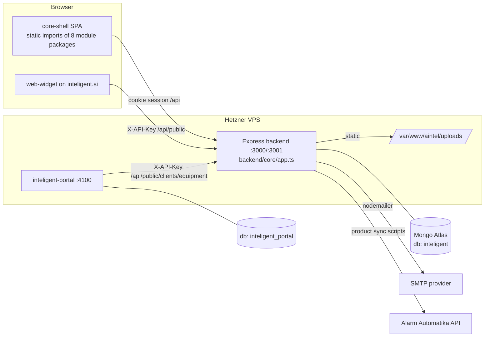

# Current Architecture

Commit `c0afad8`, 2026-07-05. Facts unless labelled otherwise.

## Overview

AIntel is a **modular monolith**: one Express backend + one Vite/React frontend bundle
(`core-shell`) that statically imports feature modules from a pnpm workspace. There are
no runtime micro-frontends, no message queue, no background workers, no scheduler.



## Backend

### Layering

```
server.ts            → loadEnv, SMTP diagnostics, connectToMongo, bootstrapAdminUser, listen
core/app.ts          → middleware pipeline + mounting
core/response.ts     → res.success / res.fail  ({ success, data, error } everywhere)
core/errorHandler.ts → global error → res.fail
core/middleware/normalizePayload.ts → Unicode NFC normalization of body/query/params
middlewares/auth.ts  → requireAuth (JWT cookie → user+employee lookup), requireRoles
routes.ts            → single mount table for all modules incl. per-mount role gates
modules/<name>/      → routes / controllers / services / schemas (pattern mostly followed)
utils/               → roles, tenant, actor, fileUpload, normalizeUnicode
```

Middleware order in `core/app.ts` (Confirmed):
1. `/api/public` (web-inquiries public router; own permissive CORS + X-API-Key + naive
   in-memory rate limit) — mounted **before** global CORS and auth.
2. Global CORS (allowlist in production: aintel domains + `AINTEL_ALLOWED_ORIGINS`).
3. `express.json`, `cookieParser`, response helpers, normalizePayload.
4. `/health`, `/api/health` (Mongo readyState).
5. `/uploads` — `express.static('/var/www/aintel/uploads')` **without auth**.
6. `/api/auth` (public), then `/api` behind `requireAuth` → `routes.ts`.
7. `errorHandler`.

### Module anatomy and quality gradient

- Newer modules (offer-version, work-order, material-order, communication,
  web-inquiries) use dedicated collections, typed schemas, services.
- Older code paths still live inside `projects/controllers/project.controller.ts`
  operating on **embedded arrays** of the Project document (offers, purchaseOrders,
  deliveryNotes, workOrders) — a parallel legacy implementation
  (see `DEAD_AND_DUPLICATED_CODE.md`).
- `logistics.controller.ts` is 2,927 lines with ~60 private helper functions —
  effectively the service layer for preparation/execution lives inside a controller
  file. Largest single complexity hotspot in the backend.

### Cross-module dependency direction (Confirmed via imports)

- `projects` → `cenik` (product truth), `finance` (snapshot on invoice issue),
  `communication` (send flows), `zahteve`, `crm` (indirect), `settings`
  (document numbering), `reviews`.
- `communication` → `projects` schemas (offers, work orders, invoices) and
  `reviews` — bidirectional coupling between projects and communication.
- `web-inquiries` → `crm`, `projects`, `zahteve`, `cenik`, `communication`, `reviews` —
  the intake engine touches six modules directly (incl. dynamic `import()` of models
  in `public.routes.ts`).
- `middlewares/auth` → `users` + `employees` schemas (identity is genuinely shared).

There is no dependency-injection or event mechanism; modules import each other's models
directly. Consequence: no module is independently deployable today.

### Error handling & validation

- Uniform response envelope via `res.success`/`res.fail` (good).
- Validation is hand-rolled per controller (no zod/joi). Quality varies:
  `web-inquiries` has thorough payload validation; many project endpoints trust input
  shapes (`Schema.Types.Mixed` fields accept anything).
- Global error handler exists; async controller errors rely on try/catch per handler
  (Express 4 does not catch rejected promises) — most controllers do catch, not all
  verified (Probable gap).

### Logging, monitoring, auditability

- **Console logging only**; no structured logger, no request logging middleware, no
  correlation IDs, no error tracker (Sentry etc.). PM2 captures stdout/stderr.
- RESOLVED (AIN-P1-06): observed live production error in logs where
  `sendInstallerPreparationEmail` cast the string `'undefined'` to ObjectId on a
  WorkOrder query. The installer-prep controller and service now guard invalid
  `workOrderId` before the WorkOrder lookup.
- Audit trail: Project embeds a `timeline` array (event id = `evt-<Date.now36>`, whole
  events written by controllers). Communication module stores `CommunicationEvent` /
  `CommunicationMessage` records. There is **no generic audit log** (who changed what
  field when) and no immutability.

### Background work, schedules, automation

- No cron, no node-cron/agenda/bull; `crontab -l` empty for user jaka (Confirmed).
- All automation is request-triggered, e.g.: web inquiry → auto client + project +
  zahteva + offer + email; offer confirm → work order + material order generation;
  invoice issue → finance snapshot (aborts invoice if snapshot fails —
  `invoice.service.ts:556`).
- Consequence: anything time-based (follow-ups, SLA, maintenance reminders) has **no
  mechanism to run** today.

### Configuration

- `.env` discovered by walking up directories (`loadEnv.ts`). Key vars (names only):
  `MONGO_URI`, `MONGO_DB`, `AINTEL_JWT_SECRET` (required in prod), `AINTEL_JWT_EXPIRES_DAYS`,
  `AINTEL_ALLOWED_ORIGINS`, `AINTEL_WEB_INQUIRY_API_KEY`, `AINTEL_BOOTSTRAP_ADMIN_*`, SMTP vars.
- Business configuration split between: `settings` module (company identity, prefixes),
  `web-inquiry-settings` model, `pdf-settings`, `communication` sender settings,
  `category-settings`, `execution-rules` — no single configuration story.
- `db/mongo.ts` sets `autoIndex: false` — schema-declared indexes are **not** created
  automatically in any environment; index creation procedure is undocumented
  (Needs verification against Atlas).

## Frontend

- `apps/core-shell`: auth pages + `CoreLayout` + static module registry (`App.tsx`),
  role-based nav filtering via `moduleRoleMap` (UI-level only).
- Module packages export `manifest` + page component; routing is path-prefix matching in
  the shell (no react-router).
- Data access: raw `fetch('/api/…')` per module (same-origin cookie auth); no shared API
  client, no react-query/SWR; each module hand-rolls loading/error state.
- `packages/ui` (Button, Card, DataTable, FileUpload, PhotoCapture/Manager, …) +
  `packages/theme` tokens; `shared/types` is the de-facto API contract between backend
  and frontend (imported by both — good).
- Hotspots: `ExecutionPanel.tsx` 3,393 lines, `OffersTab.tsx` 3,358,
  `LogisticsPanel.tsx` 3,113, `ProjectWorkspace.tsx` 1,683.
- Build: `tsc` clean at audit commit (`npx tsc --noEmit` in backend — exit 0).

## Runtime flow example (happy path)

Inquiry→invoice: widget POST `/api/public/inquiries` → validate → find/create CRM client
→ create Project (+km calc) → create Zahteva from pillar answers → generate OfferVersion
(auto-pricing from cenik) → email offer (async) → sales confirms offer
(`logistics.confirmOffer`) → WorkOrder + MaterialOrder generated → preparation steps
(material: Za naročit → … → Pripravljeno) → execution (installers tick items/units,
time tracking) → customer signature (work-order confirmation versions) → invoice from
closing (`invoice.controller`) → issue (finance snapshot) → send invoice email
(+ optional review request → public review token → Google redirect).

## Strengths

1. Consistent response envelope + central error handler.
2. Real domain depth: offer versioning, work-order confirmation versions with re-sign
   states, material step tracking, employee earnings in finance snapshots.
3. `shared/types` used by both sides — contract drift is limited.
4. Clean auth core (bcrypt-12, hashed reset/invite tokens, httpOnly+secure cookie,
   JWT secret enforced in production).
5. Uniform module skeleton makes navigation predictable.
6. The web-inquiry auto-offer engine is a genuine differentiator (lead → priced offer
   with zero human input).

## Weaknesses (summary — details in TECHNICAL_DEBT.md)

1. Project document = god-object with `Mixed` financial fields and legacy embedded
   duplicates of offers/POs/deliveries.
2. Controller-layer business logic (logistics 2.9k lines) and 3k-line React panels.
3. No tests (backend zero; frontend 4 UI-kit component tests), no CI quality gate found.
4. No observability beyond console logs; 58k PM2 restarts unexplained.
5. No scheduler → the "wheel" cannot turn by itself for anything time-based.
6. Identity joins by string (client email, customer name) instead of references.
7. Shared prod/staging DB; `autoIndex: false` without an indexing procedure.
8. Tenancy only partial (identity modules), absent on business data.
