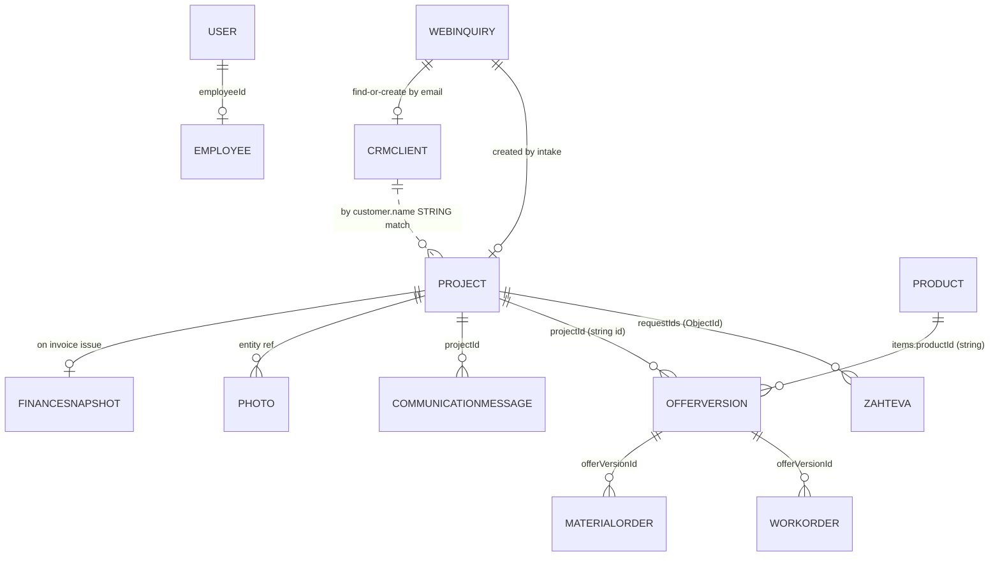

# Data Model

Commit `c0afad8`. Source: schema files only (no DB records were read). Mongo db name:
`inteligent` (shared prod+staging). `autoIndex: false` in `db/mongo.ts` — declared
indexes are not auto-created (Needs verification which exist in Atlas).

## Collections by owning module

| Collection (model) | Module | Key fields / notes |
|---|---|---|
| `projects` (Project) | projects | God-object: identity (`id`/`code`/`projectNumber`, all three unique), customer **embedded copy** (name, taxId, address), status enum (EN), quoted totals, embedded arrays: items, offers (legacy), workOrders (legacy), purchaseOrders (legacy), deliveryNotes (legacy), timeline, templates, requirements; `invoiceVersions`, `executionDefinitions`, `executionLocations`, `routeCoordinates` all `Mixed`. `createdAt` is a **String**. No tenantId. |
| `offerversions` (OfferVersion) | projects | Authoritative offers. `projectId` (string), versioning per baseTitle, rich totals incl. dual VAT (22/9.5), per-item + global discounts, status, sentAt/via. Unique index (projectId, baseTitle, versionNumber). |
| `workorders` (WorkOrder) | projects | Authoritative work orders: items with executionSpec + executionUnits (per-unit completion, who/when), time tracking events, work logs (employeeId+hours), customer signature, `confirmationVersions[]` with states unsigned/signed_active/resign_required. |
| `materialorders` (MaterialOrder) | projects | Items with per-item `materialStep` (**Slovenian enum values**: "Za naročiti" → "Pripravljeno"), pickup method/location/owner, status (EN) + `materialStatus` (SL) — two overlapping status fields. |
| `offertemplates`, `pdfsettings` | projects | Offer templates; PDF layout settings. |
| `document_number_counters` (DocumentCounter) | settings | Atomic counters for document numbering (`_id` = counter key). Good pattern. |
| `products` (Product) | cenik | Mixed SL/EN field names (`ime`, `nabavnaCena` + `purchasePriceWithoutVat`); **four** category fields (`kategorija`, `categorySlug`, `categorySlugs[]`, `categories[]`); `isService` flag on same collection; supplier (`dobavitelj`) as free text; `aaData` (supplier sync payload); `classification` = CCTV-domain-specific (camera housing, NVR channels, PoE…); merge support (`mergedIntoProductId`, status active/merged); `externalKey` unique sparse. |
| `categorysettings`, `importruns`, `importconflictresolutions`, `productservicelinks` | cenik | Category config + import audit + product→service auto-link rules. |
| `zahtevas` (Zahteva) | zahteve | Requirements per project; `sistemi[]` with tip enum `videonadzor / wifi_kamere / alarm / domofon / pametna_hisa` (Inteligent-specific), execution scenario enum (SL values), status osnutek/koncana. Linked from Project via `requestIds[]` / `activeRequestId` (ObjectId refs — one of the few real refs). |
| `crmclients` (CrmClient) | crm | name, type company/individual, vat_number, email (lowercased, **not unique**), address fields, tags, isActive. No tenantId. |
| `people`, `companies`, `notes` | crm | Early CRM entities; largely superseded by clients in practice (Probable). |
| `financeentries` (FinanceEntry) | finance | Entries derived from invoices. |
| `financesnapshots` (FinanceSnapshot) | finance | Immutable-ish snapshot at invoice issue: items, employee earnings (payment tracking via PATCH). Created inside invoice issue; failure aborts invoicing (`invoice.service.ts:556`). |
| `users` (User) | users | tenantId, email, passwordHash, status/active, employeeId ref, deletedAt, reset/invite token hashes. |
| `employees` (Employee) | employees | tenantId, name, roles[], deletedAt. Roles live on employee first, user fallback (auth middleware). |
| `employeeprofiles`, `employeeservicerates` | employee-profiles | Cost/service rates per employee. |
| `communicationmessages`, `communicationevents`, `communicationtemplates`, `sendersettings` | communication | Outbound email log + event feed per project; templates by category (offer_send, invoice, work-order confirmation, installer prep, review); single sender settings doc. |
| `webinquiries` (WebInquiry) | web-inquiries | pillar, contact (incl. siteAddress), pillar-specific answers, photos[], meta (discount), offerNumber/totals, nextStep choice, status; index (contact.email, pillar, createdAt). |
| `webinquirysettings` | web-inquiries | Which cenik products the auto-offer engine uses per pillar; enable/disable intake. |
| `photos` (Photo) | photos | Execution/project photos (sharp-processed), stored on disk under `/var/www/aintel/uploads`. |
| `reviews` (Review) | reviews | Token-based customer reviews; auto-publish 4–5 stars; Google redirect; admin moderation via web-inquiries admin routes. |
| `executionrules` | execution-rules | Product/category → execution step rules. tenantId present. |
| `settings` (Settings) | settings | Company identity singleton (name, logo, colors, prefixes, payment terms). |
| `requirementtemplates`, `offerrules` | requirement-templates | Requirement form templates + offer generation rules. |
| `dashboardstats` | dashboard | Placeholder metrics. |

Portal (`inteligent_portal` db, separate app): `Uporabnik`, `PrijavniZeton`, `Napotek`,
`Kampanja` — no shared collections with AIntel.

## Relationship map (main flows)

## Cross-cutting problems

1. **String-matching joins (High severity)**
   - Project has **no clientId**; the link client↔project is `customer.name` equality
     (used e.g. in `web-inquiries/public.routes.ts` equipment endpoint). Renaming a
     client silently orphans projects; two clients with the same name mix data.
   - Portal↔AIntel identity is client **email** (CrmClient.email is not unique).
2. **Duplicated concepts**
   - Offers exist twice (Project.offers embedded legacy vs `offerversions`).
   - Work orders / purchase orders / delivery notes embedded (legacy) vs collections.
   - Customer data copied onto Project (name/taxId/address), WorkOrder
     (customerName/email/phone/address) and confirmation versions — denormalized
     snapshots, some intentional (signed documents), some accidental.
   - CRM has both people/companies and clients; clients are what the flows use.
   - Product categories: 4 fields; material status: 2 fields + per-item step.
3. **`Mixed` schema holes (High)** — `invoiceVersions` (financial documents!),
   `executionDefinitions`, `executionLocations`, `routeCoordinates` have no schema,
   no validation, no migration path.
4. **ID discipline** — Project uses its own string `id` (`PRJ-###`) as the foreign key
   everywhere instead of `_id`; ids generated by max+1 scan
   (`generateProjectIdentifiers`) — race under concurrency (unique index turns the race
   into a 500). Timeline event ids from `Date.now()` can collide in-loop.
5. **Dates as strings** — Project.createdAt, WorkOrder.scheduledAt, PO dueDate,
   delivery receivedDate are Strings; sorting/range queries are lexical.
6. **Lifecycle rules exist only in code** — status transitions (project status,
   offer status, material steps, confirmation states) have no central state machine;
   each controller mutates status directly.
7. **Tenancy** — tenantId on identity/execution-rules/reviews/web-inquiries only;
   absent on projects, products, clients, offers, finance, settings. Settings is a
   single global document. Multi-company would require touching every collection.
8. **Indexing** — beyond unique identity indexes and a few explicit ones
   (OfferVersion compound, WebInquiry compound, MaterialOrder.projectId), list/queries
   (e.g. projects by status, messages by projectId) rely on unindexed fields;
   with `autoIndex: false` even declared ones may not exist (Needs verification).
9. **Integrity risks** — no transactions used anywhere (multi-document flows like
   confirmOffer create WorkOrder + MaterialOrder + update Project non-atomically);
   partial failure leaves inconsistent state. Delete of a client does not touch
   projects (only isActive flag mitigates).

## Migration concerns for productization

- Introduce `clientId` on Project + backfill by name-match (needs manual review pass).
- Promote `invoiceVersions` from Mixed to a real collection before anything else
  touches invoicing.
- Collapse product category fields to one; keep aliases during transition.
- tenantId backfill (constant 'inteligent') across all business collections is
  mechanical but must precede any second company.
- Decide on `_id` vs domain string ids; do not migrate ids in place — add refs.
