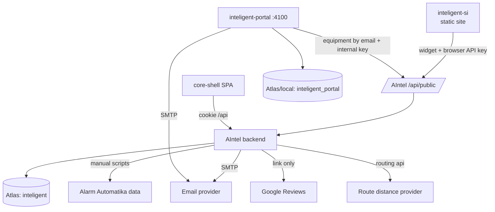

# Integration Map

Commit `c0afad8`.

## AIntel ↔ inteligent-si (website)

| Aspect | Detail |
|---|---|
| Direction | Website → AIntel |
| Mechanism | Browser JS widget `apps/web-widget/videonadzor-widget.js` embedded in pillar pages; config `window.AINTEL = { apiBase, apiKey }` **inline in public HTML** (e.g. `videonadzor.html:12`) |
| Endpoints | `GET /api/public/options`, `GET /api/public/products` (10-min cache), `POST /api/public/inquiries`, `POST /api/public/inquiries/:id/photos`, `POST /api/public/inquiries/:id/next-step`, `GET/POST /api/public/reviews*` |
| Auth | Shared static `X-API-Key` — **public by design-flaw** (readable in page source). See SECURITY_AND_PRIVACY finding S1. |
| CORS | Public router has `origin: true` (any origin) |
| Observed apiBase | `dev.inteligent.si/aintel-api` (reverse-proxy path; nginx not inspected — Probable) |
| Coupling | Widget source is versioned in the AIntel repo but deployed by copying into the website — manual sync risk (Needs verification of deploy step) |

## AIntel ↔ inteligent-portal

| Aspect | Detail |
|---|---|
| Direction | Portal → AIntel (server-to-server) |
| Mechanism | `GET /api/public/clients/equipment?email=…` with internal `X-API-Key` (`AINTEL_INTERNAL_API_KEY`; owner must roll the portal env) |
| Data | Confirmed-offer equipment per project for the client matched by email; client→project join now prefers `Project.clientId` and keeps a `customer.name` fallback for legacy rows (see DATA_MODEL) |
| Identity | Portal user email ↔ CrmClient.email (not unique, lowercase). No shared user store. |
| DBs | Fully separate (`inteligent` vs `inteligent_portal`) |
| Duplication | Portal keeps own customer records (Uporabnik) — second copy of customer identity; own SMTP sending |

## AIntel ↔ email (SMTP)

- `communication/services/email-transport.service.ts` — nodemailer, cached transporter,
  startup diagnostics (`logSmtpDiagnostics`). Env-configured host/credentials.
- Flows: offer send, invoice send, work-order confirmation, installer preparation,
  web-inquiry auto-offer, review requests. All logged to `communicationmessages` /
  `communicationevents`.
- Inbound email: none (no IMAP/webhook). Customer replies land outside the system.
- Portal has its own independent mailer (`src/pomozno.js`).

## AIntel ↔ Alarm Automatika (supplier)

- `backend/modules/cenik/sync/aaApiClient.ts` + mapper/classifier; run via npm scripts
  (`db:sync-aa`, from JSON dumps in `backend/data/cenik/`), plus admin endpoints
  `POST /api/admin/import/products/from-git`, Excel import/export (exceljs).
- Not scheduled; manual invocation only. Products carry `aaData` payload + external keys.

## AIntel ↔ Google

- Reviews: after 4–5★ submission the public endpoint returns `googleReviewUrl`
  (redirect target) — no API integration, just a link.
- Route distance: `route-distance.service.ts` (projects, `izracunaj-km`) computes
  driving distance — uses external routing (OSRM/Google — Needs verification of
  provider and API key handling; service reads env config).

## Accounting / fiscalization

- **None found** (no FURS, no e-SLOG, no accounting export in code). Invoice PDFs +
  finance snapshots are the end of the chain. Needs verification with the owner how
  accounting currently receives data (manual re-entry assumed — Probable).

## File storage

- Local disk `/var/www/aintel/uploads/{entityType}/{entityId}` (files, photos,
  web-inquiry photos). Served through authenticated `GET /uploads/*` streaming with
  path-traversal protection (AIN-P0-03). No object storage, no backup policy visible
  from the repo (Needs verification).

## Summary diagram

## Consolidation opportunities

1. One customer identity: CRM client as master; portal consumes AIntel API instead of
   its own Uporabnik store (or at least a stable `clientId` link instead of email).
2. One outbound-email service (AIntel communication module) used by portal too.
3. AIN-P0-01 split browser and portal keys in AIntel; owner still needs coordinated
   env/website rotation. Longer term: per-consumer keys and portal identity beyond
   email.
4. Widget delivery: serve `videonadzor-widget.js` from AIntel host so website always
   loads the current version.
